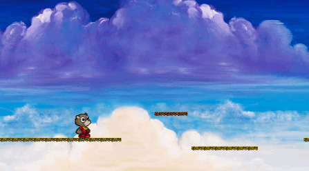
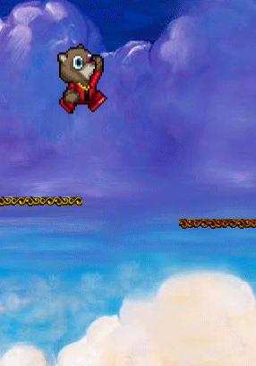
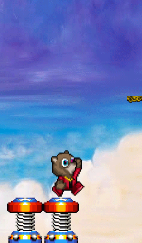
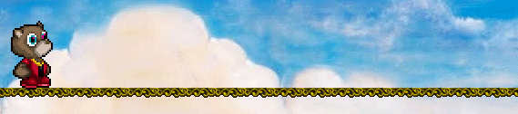

# Runaway
[Play the Game](http://markpassando.com/Runaway/)



## Contents
  * [About](#about)

  **Features**

  * [Object Oriented Design](#object-oriented-design)
  * [Platform Generation](#platform-generation)
  * [Custom Sprites](#custom-sprites)
  * [Sprite Animation](#sprite-animation)

## About
Runaway's game mechanics are inspired by the classic platform side scroller Mario. The art and aesthetic is inspired by Kanye West's song 'Runaway' from the 'My Beautiful Dark Twisted Fantasy' album. You must reach the end to save Kim without falling off the platforms.

### Features
- Game created with HTML5 Canvas and vanilla JavaScript using Object Oriented Design.
- Running, jumping and game collision physics
- Three types of platforms (Normal, Falling and Springs)
- Custom Sprites

## Object Oriented Design
All Objects in the game are based of this `gameObject` class. This gives every object the most important core properties.
````js
class gameObject {
  constructor(options) {
    const { img, x, y, width, height } = options;

    this.sprite = new Image();
    this.sprite.src = img;
    this.width = width;
    this.height = height;
    this.X = x;
    this.Y = y;
    this.previous_X;
    this.previous_Y;

    this.velocity_X = 0;
    this.velocity_Y = 0;
    this.gravity = 0;
    this.weight = 0;

  }

  isColliding(obj) {
    if (this.X > obj.X + obj.width) return false;
    if (this.X + this.width < obj.X) return false;
    if (this.Y > obj.Y + obj.height) return false;
    if (this.Y + this.height < obj.Y) return false;
    return true;
  }
}
````
## Platform Generation
Levels are designed statically therefore I created a function to make level design easy and reusable.
This `generateBlock` function can be used in many ways. It takes in an options object which can take parameters such platform type, number of platforms, space between platform if any and it's X and Y coordinates to start generation at.
````js
const generateBlock = (options) => {
  let defaultOptions = {
    type: "platform",
    num: 1,
    space: 0
  };
  let newOptions = Object.assign(defaultOptions, options);

  const { level, num, img, x, y, width, height, type, space } = newOptions;

  let totalWidth = 0;
  for (var i = 1; i <= num; i++) {
    level.blocks.push(new Block({
      img: img,
      x: x + (totalWidth),
      y: y,
      width: width,
      height: height,
      type: type
    }));

    totalWidth += width + space
  }
}
````

### Regular Platforms
This will generate 6 Regular Platform that touch side by side.
````js
  generateBlock({
    level: levelOne,
    img: "assets/platform.png",
    num: 6,
    x: 96,
    y: 400,
    width: 96,
    height: 11
  });
````

###Falling Platforms



This will generate a sequence of 3 falling platforms spaced apart by 200 X units.
````js
  generateBlock({
    level: levelOne,
    img: "assets/falling-platform.png",
    num: 1,
    x: 4200,
    y: 250,
    width: 96,
    height: 11,
    type: "falling",
    space: 200,
    num: 3
  });
````

### Spring Platforms



This will generate 2 spring platforms side by side.
````js
    generateBlock({
       level: levelOne,
       img: "assets/spring.png",
       x: 2200,
       y: 420,
       width: 60,
       height: 78,
       type: "spring",
       num: 2
     });
````
## Custom Sprites
Sprites were drawn by hand using Nintendo's Paper Mario sprites as base.

## Sprite Animation

````js
  // Code snippet 1: Width & Height of sprite sheet.
  // Sets up variables for animation
  const frameWidth = 1875/15;
  const frameHeight = 1250/10;
  let walkingMod = Math.floor(this.spriteAnimCounter) % 8;

  let actionStatus = 0;
  let frameStatus = 0;
````

````js
  let walkingMod = Math.floor(this.spriteAnimCounter) % 8;
````
`Math.floor` is necessary to throttle down `spriteAnimCounter` incrementation and 8 is the number walking Kanye Bear frames.

````js
  // Code snippet 2: If Player is walking
  // actionStatus is the postion on sprite sheet, 125 is the row for walking.
  } else if (this.velocity_X !== 0) {
    // walking
    actionStatus = 125;
    frameStatus = walkingMod;
  }
````

````js
// Code snippet 3: Using the variables canvas will draw the proper sprite animation.
  graphics.drawImage(this.sprite,
    frameStatus * frameWidth, actionStatus,
    frameWidth, frameHeight,
    playerXCoord, this.Y,
    125, 125
  );
````
I created the sprite sheet to be gridded perfectly so I could mathematically iterate through the frames. And then use the Modulo operator to repetitively animate. Sprite sheets do not have to be perfectly gridded, although I would need to put many precise static values for each and every sprite.
